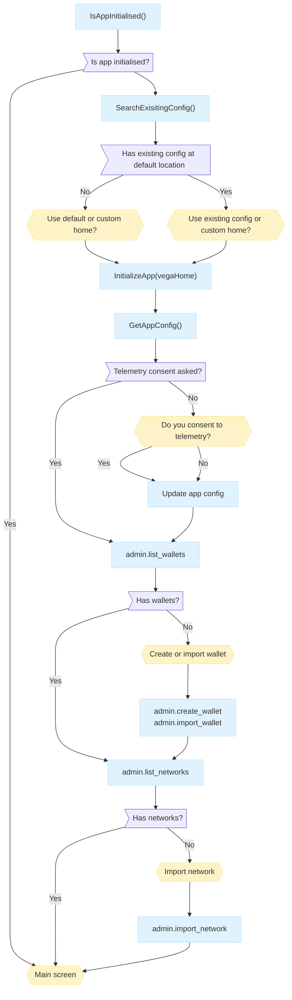

# On-boarding workflow

* Blue shapes represent calls to the backend
* Purple shapes represent decision in the front-end
* Yellow shapes represent screens to be displayed

```mermaid
flowchart TB
    be_iai["IsAppInitialised()"]:::be --> iai
    iai>Is app initialised?] -- Yes --> d_ms{{Main screen}}:::ui
    iai --> be_sec["SearchExisitingConfig()"]
    be_sec:::be --> sec>Has existing config at default location]
    sec -- Yes --> d_exoch{{Use existing config or custom home?}}:::ui
    sec -- No --> d_doch{{Use default or custom home?}}:::ui
    d_doch --> be_ia["InitializeApp(vegaHome)"]:::be
    d_exoch --> be_ia
    be_ia --> gac["GetAppConfig()"]:::be
    gac --> tca>Telemetry consent asked?]
    tca -- Yes --> be_hw[admin.list_wallets]:::be
    tca -- No --> d_tc{{Do you consent to telemetry?}}:::ui
    d_tc -- Yes --> be_sc[Update app config]:::be
    d_tc -- No --> be_sc[Update app config]:::be
    be_sc --> be_hw
    be_hw --> hw>Has wallets?]
    hw -- Yes --> be_hn[admin.list_networks]:::be
    be_hn --> hn>Has networks?]
    hw -- No --> d_coiw{{Create or import wallet}}:::ui
    d_coiw --> be_coiw[admin.create_wallet\nadmin.import_wallet]:::be
    be_coiw --> be_hn
    hn -- Yes --> d_ms
    hn -- No --> d_in{{Import network}}:::ui
    d_in --> be_in[admin.import_network]:::be
    be_in --> d_ms

    classDef ui fill:#FEF3C7,stroke:#FDE68A;
    classDef be fill:#E0F2FE,stroke:#BAE6FD;
```
